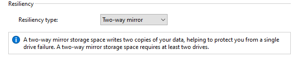

### RAID - Implementation 
## Windows

Done on VMWare Workstation 16 - Windows 10 with 4 virtual drives added to the hardware.

- Navigate to Control Panel\System and Security\Storage Spaces
- Click **Create a new pool and storage space.**
- Select drives

- At the next page, enter basic information. There are four types of resiliency: 

1. Simple (No Resiliency) – RAID 0

2. Two-Way Mirror – RAID 1

3. Three-Way Mirror – Enhanced RAID 1 (2 disks failure min)

4. Parity – RAID 5-like (Striping with Parity)

- Next we decide the **size** for this pool. We can leave the maximum size that is larger than the current drives capacity, we can add more later.

- Final screen lets us know if we succeed. As you can see, one logical drive is created from 2 hard drives. You delete, add more drives but can't change the RAID type.

- There is **Prepare for removal** option on each hard disk lets us move the data of that disk into other drives before removal.

Now we try to disconnect one of the drives to see what happen on a RAID 1 pool:

It gives a warning first, and **inaccessible** when I disconnected 2 drives. 

I got some questions here:
> There is still one drive left. Why can't we access the pool?

After some research, I found out that Windows **distributes** our data dynamically. If we delete 2 drives out of 3 in Two-way Mirror (RAID 1), the pool is gone. **Storage Spaces does not mirror entire disks like traditional RAID 1.**  
   - Instead of creating full-disk copies, it **spreads mirrored blocks dynamically** across drives.  
   - This means the last remaining drive **does not hold a complete copy of the data**—only fragments.  

> Since Two-way mirror handled maximum 1 failed drives. What if 3 drives fail?

Error too! 

### Now let's try **Parity** which is RAID 5

In RAID 5, minimum drives to fail is 2. Let's get rid of 2 drives:

As expected, the pool is doomed when three removed.

> Then why it said "...helping to protect you from **single drive failure** when it's stil accessible when 2 are removed??

Windows Storage Spaces with single parity (RAID 5-like) officially protects against one drive failure, but with more than three drives, it can sometimes survive two failures because parity and data are dynamically distributed in "slabs." In my case, having five drives allowed extra redundancy, keeping the pool usable after two failures. However, when the third drive was removed, too many data slabs were lost, making recovery impossible. This behavior differs from traditional RAID 5, where parity is evenly distributed across all disks. 

I tried again with 3 drives pool but deleted two. It's doomed: 

Now I tried again with 8 drives pool, it gets **ERROR** when 4 deleted

3 total - can't handle 2  
5 total - can't handle 3  
8 total - can't handle 4

I guess I'll blame it on Windows for their different RAID modes.